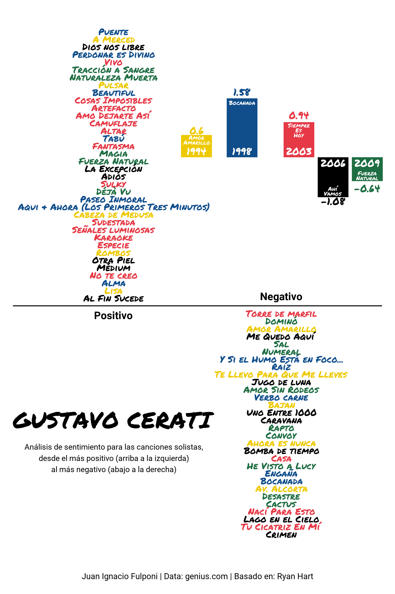

# CeRati
================

## Gustavo Cerati songs sentiment analysis

In this script, I made some sentiment analysis with `tidytext` about the
songs of the solo career of Gustavo Cerati. The final plot is a grid
arrangement with `gridExtra`.

